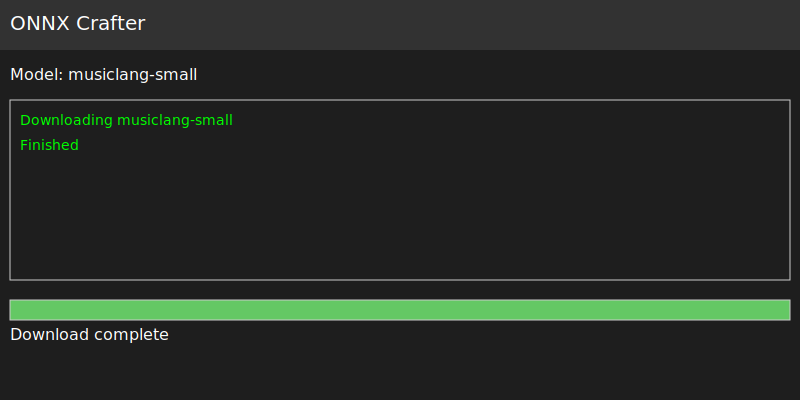
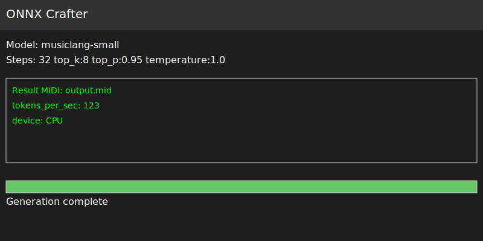

# Blossom_Music-gen

Simple demos for algorithmic music pattern generation.

A desktop interface built with [Tauri](https://tauri.app/) provides the front‑end.
Templates and scripts live under the top‑level `ui/` directory.  Command‑line
usage via `start.py` remains available for automation.  Theme selection is
remembered using Tauri's store plugin with a `localStorage` fallback.

## Quick Start

1. Create a virtual environment and install the Python dependencies:

   ```bash
   python3.10 -m venv .venv
   source .venv/bin/activate
   pip install -r requirements.txt
   ```

2. Install Node dependencies and launch the desktop app in development mode:

   ```bash
   npm install
   npm run tauri dev
   ```

3. Build a release bundle with:

   ```bash
   npm run tauri build
   ```

## Prerequisites

- **64-bit Python 3.10**
- [Node.js](https://nodejs.org/en/download/)
- [Rust](https://www.rust-lang.org/tools/install)

The `start.py` helper creates a persistent virtual environment in `.venv`
(reusing it on subsequent runs), installs the packages from `requirements.txt`
if needed, and aborts if installation fails.

## Dependencies

Mixing EQ filters now rely on `scipy`'s `lfilter` for a vectorized
implementation that removes Python loops and speeds up filtering. Install it
alongside the other requirements:

```bash
pip install scipy
```

SFZ instruments may reference WAV or FLAC samples. Loading FLAC samples requires the
[soundfile](https://pysoundfile.readthedocs.io/) library, which can be installed with:

```bash
pip install soundfile
```

For enhanced MIDI import and export support, install the optional
[mido](https://mido.readthedocs.io/) library:

```bash
pip install mido
```

To enable optional speaker diarization via
[pyannote.audio](https://github.com/pyannote/pyannote-audio), install the
``diarization`` extra:

```bash
pip install .[diarization]
```

The first invocation downloads the pretrained ``pyannote/speaker-diarization``
model. A CUDA-enabled GPU is strongly recommended for real-time use; CPU
inference is possible but significantly slower.

Example usage with the Discord transcription bot:

```python
import asyncio
from ears import run_bot, pyannote_diarize

asyncio.run(run_bot("TOKEN", 123456789012345678, diarizer=pyannote_diarize))
```

## Generate N minutes of music

1. Create a song specification JSON (see `core/song_spec.py` for fields).
2. Run the synth and specify the number of minutes you want:

```bash
pip install soundfile  # enables FLAC support
python -m core.main_synth --spec path/to/spec.json --minutes 3 --seed 42 --sampler-seed 0 --print-stats > plan.json
```

`main_synth.py` will extend the section list to meet the requested duration and print a JSON plan of events for each instrument.  The example above generates at least three minutes of material and writes it to `plan.json` while printing instrument event counts to the console.

### Reproducibility

Two parameters influence randomness:

* `--seed` controls deterministic pattern and stem generation.
* `--sampler-seed` seeds Python, NumPy and PyTorch RNGs used for phrase model sampling.

Providing both makes runs fully repeatable (the sampler seed defaults to `0`).

## Neural phrase models

Small recurrent networks can replace the deterministic pattern generators.  The
optional models live in the `models/` directory and are loaded automatically by
`main_synth.py` and `main_render.py`.  The `--use-phrase-model` flag controls
their usage: the default `auto` mode tries to load models and falls back to the
algorithmic generators if unavailable.  Passing `--use-phrase-model no`
disables model loading entirely, while `--use-phrase-model yes` requires that
models are present.

### Training prerequisites and dataset

Training requires [PyTorch](https://pytorch.org/) and, for ONNX export,
`onnxruntime`.  Datasets consist of token sequences stored in `train.jsonl` and
`val.jsonl` which can be created with `data/build_dataset.py` (see
[`docs/datasets.md`](docs/datasets.md)).  Running

```bash
python training/phrase_models/train_phrase_models.py
```

trains toy GRU models and writes checkpoints.

### Export and placement

The training script uses `torch.jit.script` and `torch.onnx.export` to emit
`<inst>_phrase.ts.pt` and `<inst>_phrase.onnx` files into `models/`.  Place the
files there so they can be picked up at runtime.

### Sampler seeding

The `--sampler-seed` CLI option seeds Python, NumPy and PyTorch RNGs used during
phrase sampling.  Providing this flag makes neural generation reproducible.

### Missing models

If a model file is absent or fails to load, the code falls back to the
deterministic pattern generators.  See
[`docs/phrase_models.md`](docs/phrase_models.md) for details.

## Style profiles

Built-in arrangement styles adjust swing and mixing defaults. See
[`docs/style_profiles.md`](docs/style_profiles.md) for the current token IDs
and guidance on adding new styles.

## Cadence fill evaluation

The repository includes a small helper to inspect note densities around
cadence markers.  `scripts/eval_cadence_fills.py` accepts JSON or JSONL
files containing token sequences or rendered stems and reports average
note density per bar.  When `CADENCE_SOON` or `FINAL` tokens are present
it compares their bars against ordinary ones and prints whether density
increases:

```bash
python scripts/eval_cadence_fills.py path/to/tokens.jsonl
```

## A/B phrase evaluation

To compare deterministic pattern synthesis against the optional neural phrase
models, use `scripts/ab_eval.py`.  The tool renders both variants for a given
song specification and seed, storing audio, note data and evaluation metrics in
the specified output directory:

```bash
python scripts/ab_eval.py --spec path/to/spec.json --seed 42 --out ab_bundle
```

The resulting bundle contains WAV files, stem JSON and `ab_eval.json` /
`metrics.csv` summaries.  These metrics cover note diversity, inter-onset
interval histograms, cadence fill rates and section-wise loudness. See
[`docs/ab_harness.md`](docs/ab_harness.md) for details on the metrics and
output bundle structure.

For explanations of individual metrics such as chord tone coverage and voice leading smoothness, see [`docs/evaluation.md`](docs/evaluation.md).


## Using External Samples

If drum hits are placed under `assets/samples/drums` and simple SFZ instruments
for bass, keys and pads live in `assets/sf2/`, the renderer will pick these up
automatically. Missing assets trigger tiny built‑in synthesiser fallbacks.

To render instruments with different SFZ files, pass paths using the
`--keys-sfz`, `--pads-sfz`, or `--bass-sfz` flags. The default configuration
points to files defined in `render_config.json`.

The `render_config.json` file also defines default sample locations for all
instruments along with stereo mix parameters.  Each track exposes gain, pan
and reverb send values.  A shared reverb bus processes the keys and pads and
the master mix passes through an automatic gain trim and a true‑peak limiter
with a ``-0.8`` dBFS ceiling by default.  All paths are relative so the
repository works out of the box after cloning.

```bash
pip install soundfile  # enables FLAC support
python main_render.py --spec path/to/spec.json --keys-sfz /path/to/custom/keys.sfz --mix out/piano.wav
```

This command renders the keys using the specified SFZ instrument and writes the mix to `out/piano.wav`.

Alternatively, choose a built‑in song template instead of providing a spec:

```bash
python main_render.py --preset pop_verse_chorus --mix out/piano.wav
```

Mix settings can also be loaded from a preset file in `assets/presets` using
`--mix-preset`:

```bash
python main_render.py --spec path/to/spec.json --mix-preset default
```

To compute metrics from a previously rendered bundle without synthesising
audio again, run:

```bash
python main_render.py --bundle path/to/bundle --eval-only
```

This reads `song.json`, `stems.mid` and `mix.wav` from the bundle and writes
`metrics.json`.

Available song templates: `pop_verse_chorus`, `lofi_loop`.

## Tauri desktop UI

The Tauri application mirrors the command‑line options and writes the same
output files.

### Launching

Install the Node and Rust dependencies and start the UI in development mode:

```bash
npm install
npm run tauri dev
```

### Build

To produce a standalone desktop build:

```bash
npm run tauri build
```

The release bundle will appear under `src-tauri/target/release`.

Fill out the fields for the song spec, optional SFZ paths, seed, and output
locations then click **Render** to run the Python pipeline.

## ONNX Crafter

Run exported [MusicLang](https://huggingface.co/models?search=musiclang) models
to craft melodies directly from ONNX graphs.

### Workflow

1. **Download a model** into `models/`:

   ```bash
   curl -L https://huggingface.co/musiclang/musiclang-small/resolve/main/model.onnx \
        -o models/musiclang-small.onnx
   ```

2. **Prepare inputs** – create a chord grid and a melody:

   ```bash
   cat > song_spec.json <<'JSON'
   ["C", "F", "G", "C"]
   JSON
   ```

   The `song_spec` format is defined in [`core/song_spec.py`](core/song_spec.py).

   ```bash
   python - <<'PY'
   from core.midi_export import stems_to_midi
   from core.stems import Stem
   stems_to_midi({"melody": [Stem(start=0, dur=1, pitch=60, vel=100, chan=0)]},
                 tempo=120, meter="4/4", path="melody.mid")
   PY
   ```

   This uses the MIDI encoder in [`core/midi_export.py`](core/midi_export.py).

3. **Run the CLI** in [`core/onnx_crafter_service.py`](core/onnx_crafter_service.py):

   ```bash
   python core/onnx_crafter_service.py \
     '{"model":"musiclang-small","song_spec":"song_spec.json","midi":"melody.mid","steps":32,"sampling":{"top_k":8,"top_p":0.95,"temperature":1.0},"out":"output.mid"}'
   ```

   `top_k` keeps only the highest-logit `k` tokens, `top_p` draws from the
   smallest set whose cumulative probability exceeds `p`, and `temperature`
   scales logits (`<1` deterministic, `>1` varied).

### GUI usage

Launch the Tauri desktop app (`npm run tauri dev`) and open the **ONNX
Crafter** panel.  Select a model and press **Download**:



Fill in a song specification or upload a melody MIDI file, adjust `top_k`,
`top_p` and `temperature`, then click **Start**.  The resulting MIDI file and
basic telemetry appear once generation finishes:



### Sampling parameters

* `top_k` – keep only the `k` highest‑logit tokens at each step.
* `top_p` – nucleus sampling; draw from the smallest set of tokens whose
  cumulative probability exceeds `p`.
* `temperature` – scale logits before sampling.  Values <1 make predictions more
  deterministic, while values >1 increase variety.

## Discord transcription pipeline

The `ears.pipeline` module can capture audio from a Discord voice channel and
transcribe speech using Whisper. Transcripts are written to JSONL files under
`transcripts/`.

```python
import asyncio
from ears.pipeline import run_bot


async def on_part(part, speaker):
    print(f"{speaker}: {part.text}")


asyncio.run(
    run_bot(
        "TOKEN",
        123456789012345678,
        part_callback=on_part,
        rate_limit=0.3,
    )
)
```

Replace `TOKEN` with your bot token and the integer with the target voice
channel ID. ``part_callback`` receives both partial and final transcript
segments; ``rate_limit`` throttles how often partial updates are emitted.

## Mouth

The `mouth` package adds text-to-speech capabilities powered by
[Piper](https://github.com/rhasspy/piper). It can stream synthesized
speech to Discord voice channels or generate narration for other
systems.

### Piper installation

Install the `piper-tts` command-line tool and download at least one
voice model:

```bash
pip install piper-tts soundfile
piper --download en_US-amy-medium
```

Pass the model path to :class:`~mouth.tts.TTSEngine` or to the helper
functions shown below.

### Narrator and NPC voices

Voice profiles are stored in ``data/voices.json`` and loaded via
``VoiceRegistry``.  A ``narrator`` profile is always present and is
used when no ``voice`` name is supplied.  Assign Piper models to the
default narrator and to non-player characters (NPCs) by updating the
registry:

```python
from mouth import VoiceRegistry, VoiceProfile

registry = VoiceRegistry()
registry.set_profile("narrator", VoiceProfile("/path/to/narrator.onnx"))
registry.set_profile("goblin", VoiceProfile("/path/to/goblin.onnx"))
registry.save()
```

Later, pass ``voice="goblin"`` to select the NPC voice.

### Cache and warm start

Voice profiles are cached on disk; subsequent runs reuse the registry
and avoid reconfiguration.  Piper loads the voice model on first use, so
keeping a ``TTSEngine`` instance alive or calling ``engine.synthesize("")``
during startup warms the cache and eliminates initial latency.

### Discord example

See ``docs/examples/discord_piper_tts.py`` for an end-to-end snippet that
joins a voice channel and speaks a line of dialog.

